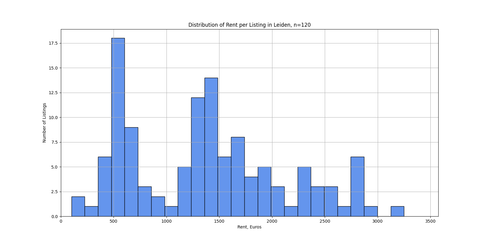
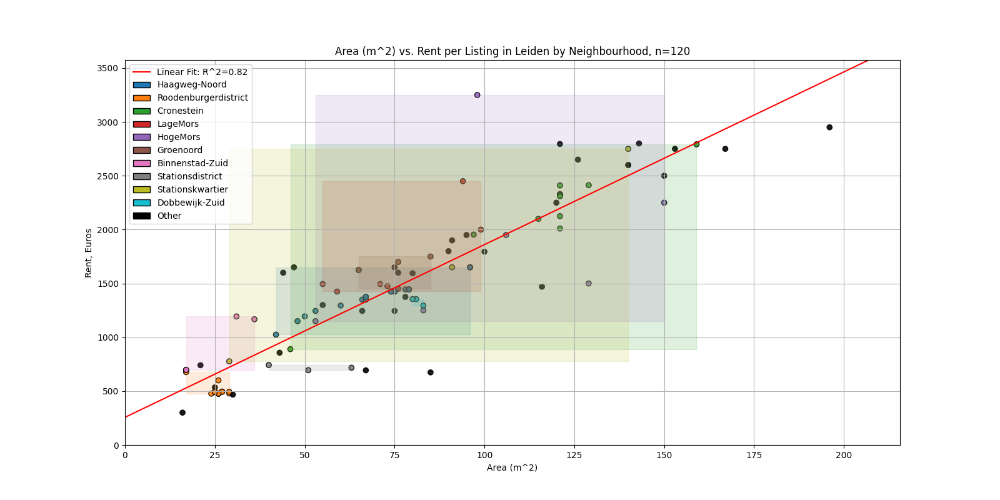

# House Search

## Summary
Working project on retrieving information on available rentals in Leiden from the following sites:
* Room
* Funda
* Kamernet
* Pararius

Data retrieved using bare Python `requests` as well as Selenium and the classes that run/execute these queries can be run from CRON. Listing information stored in SQLite database for later retrieval/analysis. Some initial visualizations can be seen below.

## Note on proxies for Selenium
Funda/Pararius require a proxy list, otherwise requests will fail. Published code does not support generation/acquisition of proxies. Proxies can be passsed directly as a list of IP addesses/ports or as a file path to be read in via `puller_configs.py` by changing the value of `PROXY_PATH`. Files must be `.txt.` files with only `\n` seperators between IP adresses. In either case, addresses must be in the format `123.456.789:8080`. Running through `pullers_run.py` only supports file based proxy read-in, until input ingestion is switched from `sys.argv` to `argparse`.

## Running Instructions
1. Set up and activate a `venv` for `house_search`
2. Run `pip install -r requirements.txt`
3. Populate a file named `proxy_list.txt`, or if using a different file name, change the value of `PROXY_PATH` in `puller_configs.py`
    * It is recommended that this list is generated as close as possible to run time if you do not control your proxies, to avoid dead proxies. `utils.py` handles dead proxies by validating prior to using for a request, but this adds to the overall run time.
4. Run `puller_run.py` from the command line with a `headless` parameter if needed, i.e. `python3 puller_run.py T` for headless run, or `python3 puller_run.py F` for non-headless run

From here you can access `listings.db` using `sqlite` as needed. Short examples provided in `db_retrieval.ipynb`.

### License

MIT License 

Copyright (c) 2024 Colin Yip

Permission is hereby granted, free of charge, to any person obtaining a copy
of this software and associated documentation files (the "Software"), to deal
in the Software without restriction, including without limitation the rights
to use, copy, modify, merge, publish, distribute, sublicense, and/or sell
copies of the Software, and to permit persons to whom the Software is
furnished to do so, subject to the following conditions:

The above copyright notice and this permission notice shall be included in all
copies or substantial portions of the Software.

THE SOFTWARE IS PROVIDED "AS IS", WITHOUT WARRANTY OF ANY KIND, EXPRESS OR
IMPLIED, INCLUDING BUT NOT LIMITED TO THE WARRANTIES OF MERCHANTABILITY,
FITNESS FOR A PARTICULAR PURPOSE AND NONINFRINGEMENT. IN NO EVENT SHALL THE
AUTHORS OR COPYRIGHT HOLDERS BE LIABLE FOR ANY CLAIM, DAMAGES OR OTHER
LIABILITY, WHETHER IN AN ACTION OF CONTRACT, TORT OR OTHERWISE, ARISING FROM,
OUT OF OR IN CONNECTION WITH THE SOFTWARE OR THE USE OR OTHER DEALINGS IN THE
SOFTWARE.
